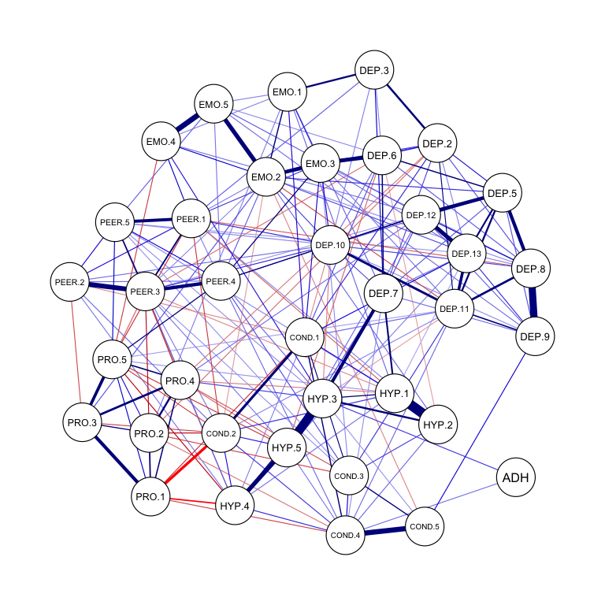
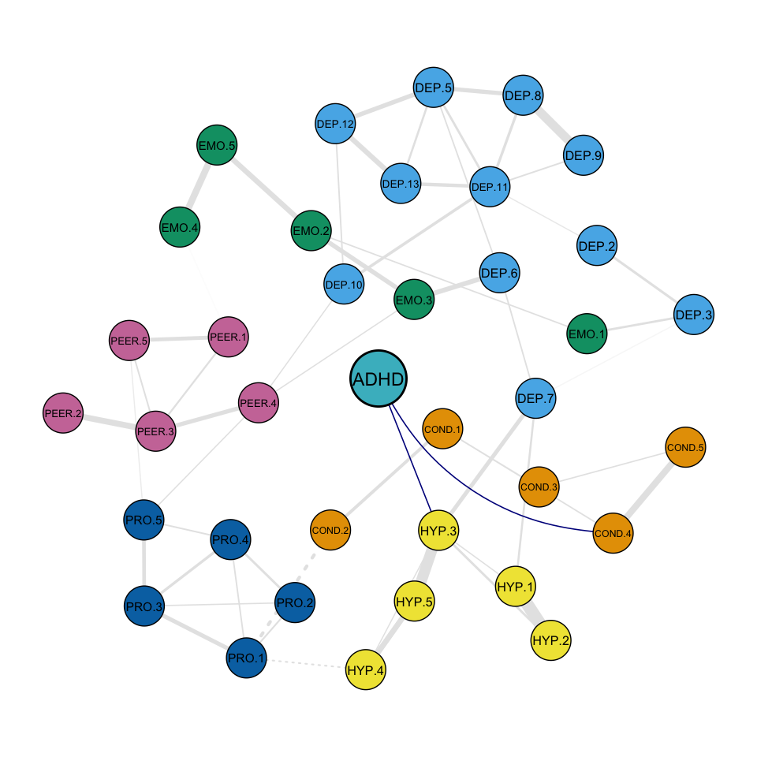

# Example of analysis pipeline - Unweaving the polygenic web
Giulia Piazza


This is an example of the pipeline followed for the analysis in **"Unweaving the web: Polygenic influences on networks of psychopathology symptoms"**. The example is focused only on the network with the polygenic score for ADHD for demonstration purposes. All parts of the analysis were run via a computer cluster due to the computing power required. Although this example is not directly reproducible (as it requires raw data), the resulting objects can be found in pipeline_example.RData in this [Github repo](https://github.com/giuliapiazza18/Unweaving-the-polygenic-web-pipeline).

The preregistration of the confirmatory analysis of this project can be found [here](https://osf.io/7y2g8) in the respective [OSF project](https://osf.io/28ehr/).

# Load packages and data

Loading imputed and cleaned data from ALSPAC and TEDS (see paper for more details). Polygenic scores were all calculated with [this script](https://github.com/giuliapiazza18/Unweaving-the-polygenic-web-pipeline/blob/master/LDPred_ADHD.R), which follows [this LDpred2 tutorial](https://privefl.github.io/bigsnpr/articles/LDpred2.html) (accessed in September 2022). The ADHD polygenic score was derived from effect sizes in [Demontis et al. (2019)](https://www.nature.com/articles/s41588-018-0269-7).


```r
library(qgraph)
library(bootnet)
library(dplyr)
library(psychonetrics)
library(readxl)
```


# Estimate network in ALSPAC

Estimating the ADHD polygenic score network in ALSPAC with unregularised model search with the package 'bootnet'.


```r
selection = c("DEP.2","DEP.3", "DEP.5","DEP.6", "DEP.7",
              "DEP.8","DEP.9","DEP.10","DEP.11","DEP.12","DEP.13","PRO.1", 
              "HYP.1","EMO.1","PRO.2","COND.1","PEER.1","COND.2","EMO.2", 
              "PRO.3","HYP.2","PEER.2","COND.3","EMO.3","PEER.3","HYP.3", 
              "EMO.4","PRO.4","COND.4","PEER.4","PRO.5","HYP.4","COND.5",
              "PEER.5","EMO.5","HYP.5") # select relevant variables

adhd.network <- ALSPAC %>%
  dplyr::select(selection, ADHD.ld) %>%
  estimateNetwork(., default = "ggmModSelect", stepwise = TRUE) # estimate network with 'ggmModSelect', selected nodes and ADHD PRS calculated with LDPred2
```

# Plot network

Plotting the resulting network with the package 'qgraph' for a quick preliminary visualisation. 


```r
qgraph(adhd.network$graph, layout = "spring", theme = "colorblind")
```

<!-- -->

# Non-parametric bootstraps

Calculating non-parametric bootstraps (this is time intensive) with 'bootnet'.


```r
adhd.boot <- bootnet(adhd.network,  nBoots = 1000, default = "ggmModSelect", type = "nonparametric", nCores = 20)
```


# Confirmatory Network Analysis

## Model 1

Model 1 tests the fit of the network estimated in ALSPAC in TEDS. Here, I take the adjacency matrix of the ADHD polygenic score network calculated above (a matrix with ones/zeros for presence/absence of edges) and test its fit in TEDS data.


```r
# extract structure
adhd.structure = 1*(adhd.network$graph != 0)

# test how well structure fits to teds data
adhd.model = TEDS %>% dplyr::select(DEP.2:HYP.5, ADHD) %>% 
  ggm(., estimator = "FIML", omega = adhd.structure) %>% runmodel()

adhd.model %>% fit() # inspect model fit
```

```
##            Measure      Value
##               logl -222605.98
##  unrestricted.logl -221910.32
##      baseline.logl -242816.22
##               nvar         37
##               nobs        740
##               npar        280
##                 df        460
##          objective      28.26
##              chisq    1391.31
##             pvalue        ~ 0
##     baseline.chisq   41811.79
##        baseline.df        666
##    baseline.pvalue        ~ 0
##                nfi       0.97
##               pnfi       0.67
##                tli       0.97
##               nnfi       0.97
##                rfi       0.95
##                ifi       0.98
##                rni       0.98
##                cfi       0.98
##              rmsea      0.021
##     rmsea.ci.lower      0.020
##     rmsea.ci.upper      0.022
##       rmsea.pvalue          1
##             aic.ll  445771.96
##            aic.ll2  445808.18
##              aic.x     471.31
##             aic.x2    1951.31
##                bic  447574.94
##               bic2  446685.21
##            ebic.25  448586.00
##             ebic.5  449597.05
##            ebic.75  450405.90
##              ebic1  451619.17
```

## Model 2

Model 2 involves multi-group testing and assesses whether edges have comparable weights in ALSPAC and TEDS. Here, I create a combined data frame with ALSPAC and TEDS data, with a column indicating the cohort. I then use the package 'psychonetrics' to run a model where edge weights in ALSPAC and TEDS are set to be equal, and compare it to a model where they are set free to vary.


```r
alspac.data = ALSPAC %>% dplyr::select(selection, BMI.ld:ANX.P.ld, ADHD.ld) # create dataframe with relevant vars for alspac
colnames(alspac.data) = c(selection,  "BMI",  "EA",   "DEP", "ANX",  "ADHD")

alspac.data$group = "alspac"  

teds.data = TEDS %>% dplyr::select(selection,  "BMI",  "EA",   "DEP", "ANX",  "ADHD") # select relevant vars for teds
teds.data$group = "teds"

comb.data = rbind(alspac.data, teds.data) # create dataset of combined teds and alspac

comb.model.adhd <- comb.data %>% dplyr::select(DEP.2:HYP.5, ADHD, group) %>% 
  ggm(., estimator = "FIML", omega = adhd.structure, groups = "group") %>% 
  groupequal("omega") %>% runmodel # run a model where edges are equal in alspac and teds

comb.model.adhd.fit = comb.model.adhd %>% fit()
```

```
##            Measure      Value
##               logl -485929.72
##  unrestricted.logl -484280.22
##      baseline.logl -532672.39
##               nvar         37
##               nobs       1480
##               npar        354
##                 df       1126
##          objective      27.79
##              chisq    3298.99
##             pvalue        ~ 0
##     baseline.chisq   96784.32
##        baseline.df       1332
##    baseline.pvalue        ~ 0
##                nfi       0.97
##               pnfi       0.82
##                tli       0.97
##               nnfi       0.97
##                rfi       0.96
##                ifi       0.98
##                rni       0.98
##                cfi       0.98
##              rmsea      0.020
##     rmsea.ci.lower      0.019
##     rmsea.ci.upper      0.020
##       rmsea.pvalue          1
##             aic.ll  972567.43
##            aic.ll2  972593.10
##              aic.x    1046.99
##             aic.x2    4006.99
##                bic  975125.03
##               bic2  974000.06
##            ebic.25  976403.29
##             ebic.5  977681.56
##            ebic.75  978704.17
##              ebic1  980238.09
```

```r
free.model.adhd = comb.data %>% dplyr::select(DEP.2:HYP.5, ADHD, group) %>% 
  ggm(., estimator = "FIML", omega = adhd.structure, groups = "group") %>% runmodel # run a model where edges can vary 

knitr::kable(compare("free" = free.model.adhd,
"constrained" = comb.model.adhd), row.names = FALSE)
```


|model       |   DF|      AIC|      BIC|     RMSEA|    Chisq| Chisq_diff| DF_diff| p_value|
|:-----------|----:|--------:|--------:|---------:|--------:|----------:|-------:|-------:|
|free        |  920| 971926.3| 975972.2| 0.0168545| 2245.815|         NA|      NA|      NA|
|constrained | 1126| 972567.4| 975125.0| 0.0195041| 3298.985|    1053.17|     206|       0|

## Model 3

Model 3 tests the significance of all edges connected to the polygenic score for ADHD at the same time. Here, I compare a model where all edges between the polygenic score for ADHD are set to zero to the original network model in a combined dataset of TEDS and ALSPAC. 


```r
# set ALL edges connecting the PGS to zero
adhd.structure.3 = adhd.structure
adhd.structure.3[37,] = adhd.structure.3[,37] = 0

adhd.model.3 = comb.data %>% dplyr::select(DEP.2:HYP.5, ADHD, group) %>% 
  ggm(., estimator = "FIML", omega = adhd.structure.3, groups = "group") %>% 
  groupequal("omega") %>% runmodel
  
knitr::kable(compare("original network" = comb.model.adhd,
"network with no pgs edges" = adhd.model.3), row.names = FALSE)
```


|model                     |   DF|      AIC|    BIC|     RMSEA|    Chisq| Chisq_diff| DF_diff| p_value|
|:-------------------------|----:|--------:|------:|---------:|--------:|----------:|-------:|-------:|
|original network          | 1126| 972567.4| 975125| 0.0195041| 3298.985|         NA|      NA|      NA|
|network with no pgs edges | 1128| 972701.9| 975245| 0.0200892| 3437.405|   138.4199|       2|       0|

## Model 4

Model 4 tests the significance of a single edge connected to the ADHD polygenic score at a time, for all edges connected to the polygenic score. Here, for every edge connected to the ADHD polygenic score in the original network (edges connecting nodes HYP.3 and COND.4), I create a model where they are set to zero with a function, in a combined dataset of TEDS and ALSPAC. I then compare both models to the original network model. 


```r
# Function to set ONE edge connecting the PGS to zero progressively
model4 = function(alspac.structure,node1,node2) {
  
  # alspac.structure = structure of alspac network
  # node 1 and node 2 = nodes of interest as strings; 
  # node 1 is the PGS

  one = grep(paste(node1), colnames(alspac.structure)) # index of node 1 (PGS)
  nodes = which(alspac.structure[,one] ==1) # list of edges connecting node 1
  two = nodes[which(names(nodes) == paste(node2))] # index of node 2
  
  new.structure = alspac.structure # duplicate the original alspac structure
  new.structure[one,two] = new.structure[two,one] = 0 # set the edge between node 1 and 2 to zero
  model = comb.data %>% dplyr::select(DEP.2:HYP.5, paste(node1),group) %>% 
  ggm(., estimator = "FIML", omega = new.structure, groups = "group") %>% 
  groupequal("omega") %>% runmodel # create and run the model
  return(model)
}

## HYP.3
adhd.model.4.HYP = model4(adhd.structure,"ADHD", "HYP.3")
knitr::kable(compare("original network" = comb.model.adhd,
"without edge adhd-hyp3" = adhd.model.4.HYP), row.names = FALSE)
```


|model                  |   DF|      AIC|      BIC|     RMSEA|    Chisq| Chisq_diff| DF_diff| p_value|
|:----------------------|----:|--------:|--------:|---------:|--------:|----------:|-------:|-------:|
|original network       | 1126| 972567.4| 975125.0| 0.0195041| 3298.985|         NA|      NA|      NA|
|without edge adhd-hyp3 | 1127| 972650.6| 975200.9| 0.0198693| 3384.125|   85.13986|       1|       0|

```r
## COND.4
adhd.model.4.COND= model4(adhd.structure,"ADHD", "COND.4")
knitr::kable(compare("original network" = comb.model.adhd,
"without edge adhd-cond4" = adhd.model.4.COND), row.names = FALSE)
```


|model                   |   DF|      AIC|    BIC|     RMSEA|    Chisq| Chisq_diff| DF_diff| p_value|
|:-----------------------|----:|--------:|------:|---------:|--------:|----------:|-------:|-------:|
|original network        | 1126| 972567.4| 975125| 0.0195041| 3298.985|         NA|      NA|      NA|
|without edge adhd-cond4 | 1127| 972591.6| 975142| 0.0196081| 3325.169|   26.18379|       1|   3e-07|

## Model 5

Lastly, model 5 tests whether ALSPAC and TEDS have comparable edge weights in a single edge connected to the ADHD polygenic score. Here, I create model where equality constrains are lifted between the edges connecting the polygenic score to nodes HYP.3 and COND.4, and compare them to a model where they are set to be equal.


```r
model5 = function(alspac.structure,node1,node2,eq.model) {
  
  # alspac.structure = structure of alspac network
  # node 1 and node 2 = nodes of interest as strings; 
  # node 1 is the PGS; 
  # eq.model = model with equality constrains to modify
  
  one = grep(paste(node1), colnames(alspac.structure)) # index of node 1 (PGS)
  nodes = which(alspac.structure[,one] ==1) # list of edges connecting node 1
  two = nodes[which(names(nodes) == paste(node2))] # index of node 2
  model = eq.model %>% 
  groupfree("omega",one,two) %>% 
  runmodel() # modify equality constrains model, lifting one edge constrain
  return(model)
}

# set edges connecting the PGS to free to vary, lift equality constrains
adhd.model.5.HYP <- model5(adhd.structure, "ADHD", "HYP.3", comb.model.adhd)
knitr::kable(compare("original network" = comb.model.adhd, 
"free edge adhd-hyp3" = adhd.model.5.HYP), row.names = FALSE)
```


|model               |   DF|      AIC|      BIC|     RMSEA|    Chisq| Chisq_diff| DF_diff|   p_value|
|:-------------------|----:|--------:|--------:|---------:|--------:|----------:|-------:|---------:|
|free edge adhd-hyp3 | 1125| 972569.3| 975134.1| 0.0195166| 3298.820|         NA|      NA|        NA|
|original network    | 1126| 972567.4| 975125.0| 0.0195041| 3298.985|  0.1651108|       1| 0.6844941|

```r
adhd.model.5.COND <- model5(adhd.structure, "ADHD", "COND.4", comb.model.adhd)
knitr::kable(compare("original network" = comb.model.adhd, 
"free edge adhd-cond4" = adhd.model.5.COND), row.names = FALSE)
```


|model                |   DF|      AIC|      BIC|     RMSEA|    Chisq| Chisq_diff| DF_diff|   p_value|
|:--------------------|----:|--------:|--------:|---------:|--------:|----------:|-------:|---------:|
|free edge adhd-cond4 | 1125| 972569.1| 975133.9| 0.0195156| 3298.608|         NA|      NA|        NA|
|original network     | 1126| 972567.4| 975125.0| 0.0195041| 3298.985|  0.3777227|       1| 0.5388245|

# Plotting the network focusing on the polygenic score

Here, I plot the network focusing on the polygenic score by placing it in the centre of the graph, using custom functions which can be found [here](https://github.com/giuliapiazza18/Unweaving-the-polygenic-web-pipeline).

```r
# load networks and legend ----
quest.sub = read_excel("mfq_sdq_key_11_subscale.xlsx")
quest.sub = quest.sub[-c(1,4),]  # removing items not in teds and in these reduced networks

# load functions ----
source("qgraph.alt.R") # modified qgraph function: plots by avoiding highlighted edges crossing under other ones
source("support.functions.R") # support functions to qgraph.alt
source("unfade.centre.nolegend.R") # unfading function

# load average layout with PGS in the centre ----
avglay = as.matrix(read.csv("avglay.csv", 
                            header = FALSE))

node.one = which(colnames(adhd.network$graph) == "ADHD.ld")
node.two = which(colnames(adhd.network$graph) == "COND.4")
curve.adhd = matrix(0, ncol = 37, nrow = 37)
curve.adhd[node.one, node.two] = curve.adhd[node.two, node.one] = 0.7
graph = unfade.nolegend(adhd.network$graph, PGSnode = "ADHD", PGSdesc = "Polygenic Score for ADHD - ALSPAC", PGScolor = "#46BAC8", 
avglay = avglay, curve.matrix = curve.adhd)
plot(graph)
```

<!-- -->


